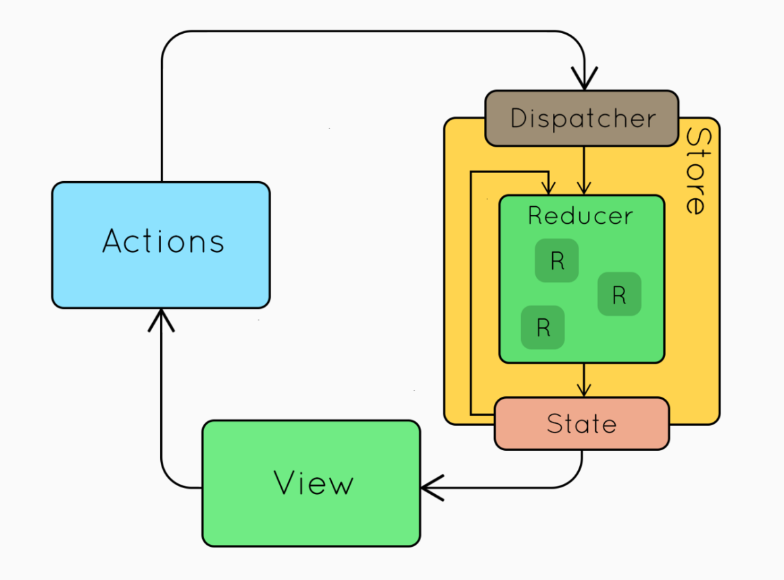

# React Techniques

## Intro

### What we will cover:

- Why React, Part 2
- Create React App
- Compound Components
- Redux

## Why React, Part 2

What was front-end development like before React?

Let’s go over a history of front-end libraries exploring…

- jQuery
- Backbone
- Angular

Let's look at a [demo](http://localhost:8080/HelloWorld/lecture.html) looking at the same UI to search Wikipedia and display the top 10 entries.

### jQuery

```js
import $ from "jquery"
import { search } from "./utils/searchWikipedia"

const html = `
<div>
	<h1>Wikipedia</h1>
	<form id="form">
		<input id="input" value="bootcamp"/>
		<button type="submit">Search</button>
	</form>
	<div id="loading">Loading...</div>
	<div id="meta">
		<p>Results for: <span id="title"></span><p>
		<p>
		<label>
			<input type="checkbox" id="descending">
				Sort Descending
		</label>
		</p>
	</div>
	<ul id="results"></ul>
</div>
`

$("#app").html(html) // <-- component

$("#form")
	.on("submit", event => { // <-- state change
		event.preventDefault()
		const term = $("#input").val() // <-- state
		$("#loading").show() // <-- time
		$("#meta").hide() // <-- time
		$("#results").empty() // <-- time
		search(term, (err, results) => {
			$("#loading").hide() // <-- time
			$("#meta").show() // <-- time
			$("#title").html(term) // <-- time
			results.forEach(result => {
				const li = $("<li/>")
				const html = `
<div>
	${result.title}
	<button>show more</button>
</div>
<div class="toggler" style="display: none">
	<p>${result.description}</p>
</div>
`
				li.html(html) // <-- time
				if ($("#descending").is(":checked")) { // <-- state
					li.prependTo($("#results")) // <-- time
				} else {
					li.appendTo($("#results")) // <-- time
				}
				li.find("button").on("click", () => { // <-- component
					li.find(".toggler").toggle() // <-- time
					const isHidden = li.find(".toggler").is(":hidden") // <-- state
					li
						.find("button")
						.html(isHidden ? "show more" : "hide") // <-- time
				})
			})
		})
	})
	.trigger("submit") // <-- state change

$("#descending").on("click", event => { // <-- state change
	$("#results li").each((i, li) => {
		$("#results").prepend(li) // <-- time
	})
})
```

**Advantages:**

...

**Disadvantages:**

- Code written as flows
- Does not call out state
- No entry point to change state
- With every feature request, multiple places to change code
- Hard to think about. Leads to lots of bugs

### Backbone

```js
import Backbone from "backbone"
import $ from "jquery"
import _ from "underscore"
import { search } from "./utils/searchWikipedia"

const appTemplate = _.template(`
<div>
	<h1><%= title %></h1>
	<form id="form">
		<input id="input" value="bootcamp"/>
		<button type="submit">Search</button>
	</form>
	<% if (loading) { %>
		<div id="loading">Loading...</div>
	<% } else { %>
		<div id="meta">
			<p>Results for: <span id="title"><%= term %></span><p>
			<p>
				<label>
					<input type="checkbox" id="descending" <%= descending ? 'checked' : '' %>>
					Sort Descending
				</label>
			</p>
		</div>
	<% } %>
	<ul id="results">
		<% results.forEach(function(result) { %>
			<li class="toggleView"></li>
		<% }) %>
	</ul>
</div>
`)

const AppView = Backbone.View.extend({
	template: appTemplate,

	events: { // <-- delegated state changes
		"submit #form": "handleSubmit",
		"click #descending": "handleDescending"
	},

	initialize() {
		this.listenTo(this.model, "all", this.render)
		this.listenTo(this.model, "change:term", this.search)
		this.render()
		this.search()
	},

	handleSubmit(event) {
		event.preventDefault()
		this.model.set("term", this.$el.find("#input").val()) // KVO Web
	},

	search() {
		this.model.set({
			// KVO web
			loading: true,
			results: [],
			descending: false // cascading update!
		})
		search(this.model.get("term"), (err, results) => {
			this.model.set({ // KVO web
				loading: false,
				results: results
			})
		})
	},

	handleDescending() {
		this.model.set( // <-- KVO web
			"descending",
			!this.model.get("descending")
		)
	},

	render() {
		const state = this.model.toJSON()
		if (state.descending)
			state.results = state.results.slice(0).reverse()
		this.$el.html(this.template(state)) // DOM Bomb!
		this.$el.find("#results li").each((index, el) => {
			new ToggleView({
				// <-- imperative (re)composition!
				el: el,
				model: new Backbone.Model(state.results[index])
			}).render()
		})
	}
})

const ToggleView = Backbone.View.extend({
	template: _.template(`
<div>
	<%= title %>
	<button>show more</button>
</div>
<% if (isOpen) { %>
	<div>
		<p><%= description %></p>
	</div>
<% } %>
`),

	events: {
		"click button": "toggle"
	},

	initialize() {
		this.model.set("isOpen", false, { silent: true }) // <-- model ownership?
		this.listenTo(this.model, "change:isOpen", this.render)
	},

	toggle() {
		this.model.set("isOpen", !this.model.get("isOpen")) // <-- KVO web
	},

	render() {
		this.$el.html(this.template(this.model.toJSON()))
	}
})

new AppView({
	el: "#app",
	model: new Backbone.Model({
		title: "Wikipedia",
		loading: false,
		term: "bootcamp",
		descending: false,
		results: []
	})
})
```

**Advantages:**

- Moved state to models so we can identify what state changes the app.
- Moved creating UI into templates, one step closer to being declarative

**Disadvantages:**

- DOM Bombs
  - kill focus for assistive devices
  - non-performant

- KVO (Key-Value Observing) Web
  - can't predict what will happen if you change state
    > Events interweave communication and flow of control.
    > ... their fundamental nature, ... is that upon an event
    > an arbitrary amount of other code is run
    > http://clojure.com/blog/2013/06/28/clojure-core-async-channels.html

  - leads to cascading updates
    - non-performant
    - to fix leads to knowing how your app changes over time intimately

- imperative composition
  - non-performant
  - to fix
    - have to know how your app changes over time intimately
    - lots of code to manage instances
    - lots of mistakes

### Angular

```js
import angular from "angular"
import { search } from "./utils/searchWikipedia"

document.documentElement.setAttribute("ng-app", "wikipedia")

document.getElementById("app").innerHTML = `
<div ng-controller="MainController as main">
	<h1>Wikipedia</h1>
	<form ng-submit="main.handleSubmit()">
		<input ng-model="main.term"/>
		<button type="submit">Search</button>
	</form>
	<div ng-if="main.loading">Loading...</div>
	<div>
		<p>{{main.sortedResults().length}} results for: {{main.term}}<p>
		<p>
			<label>
				<input
					type="checkbox"
					ng-model="main.descending"
				>
				Sort Descending
			</label>
		</p>
	</div>
	<ul id="results">
		<li ng-repeat="result in main.sortedResults() track by result.title">
			<toggler title="{{result.title}}">
				<p>{{result.description}}</p>
			</toggler>
		</li>
	</ul>
</div>
`

const app = angular.module("wikipedia", [])

app.controller("MainController", function($rootScope) {
	const main = this
	main.term = "bootcamp" // <-- shared state!
	main.results = []
	main.loading = false
	main.descending = false

	main.getFriends = () => {
		return [{ name: "Jeremy" }]
	}

	main.handleSubmit = () => {
		main.loading = true
		search(main.term, (err, results) => {
			main.results = results
			main.loading = false
			$rootScope.$digest() // <-- time!
		})
	}

	main.sortedResults = () => {
		return main.descending
			? main.results.slice(0).reverse()
			: main.results
	}

	main.handleSubmit()
})

app.directive("toggler", () => { // <-- Global!
	return {
		restrict: "E", // WTH?
		scope: {
			title: "@" // WTH?
		},
		controller($scope) {
			$scope.isOpen = false
			$scope.toggle = () => {
				$scope.isOpen = !$scope.isOpen
			}
		},
		replace: true,
		transclude: true, // WTH?
		template: `
<div>
	<div>
		{{title}}
		<button ng-click="toggle()">show more</button>
	</div>
	<div ng-if="isOpen" ng-transclude></div>
<div>
`
	}
})
```

**Advantages:**

- fully declarative templates
- declarative component composition

**Disadvantages:**

- directives and filters are globals
- have to think about time with $apply/$watch, etc.
- rendering assumptions require you to keep object identity
  and therefore think about time
- and the real kicker: shared mutable state

## Create React App

> You don’t need to install or configure tools like Webpack or Babel.
>
> They are preconfigured and hidden so that you can focus on the code.
>
> Just create a project, and you’re good to go.
>
> -- From create-react-app library README

### Converting to a Custom Setup

> If you’re a power user and you aren’t happy with the default configuration, you can “eject” from the tool and use it as a boilerplate generator.

> Running npm run eject copies all the configuration files and the transitive dependencies (Webpack, Babel, ESLint, etc) right into your project so you have full control over them. Commands like npm start and npm run build will still work, but they will point to the copied scripts so you can tweak them. At this point, you’re on your own.

>
> -- From create-react-app library README

## Compound Components

```js
import React from "react"
import ReactDOM from "react-dom"
import PropTypes from "prop-types"
import * as styles from "./styles"

class Tabs extends React.Component {
  state = {
    activeIndex: 0
  }

  selectTabIndex(activeIndex) {
    this.setState({ activeIndex })
  }

  renderTabs() {
    return this.props.data.map((tab, index) => {
      const isActive = this.state.activeIndex === index
      return (
        <div
          key={tab.label}
          style={isActive ? styles.activeTab : styles.tab}
          onClick={() => this.selectTabIndex(index)}
        >
          {tab.label}
        </div>
      )
    })
  }

  renderPanel() {
    const tab = this.props.data[this.state.activeIndex]
    return <div>{tab.description}</div>
  }

  render() {
    return (
      <div>
        <div style={styles.tabs}>{this.renderTabs()}</div>
        <div style={styles.tabPanels}>{this.renderPanel()}</div>
      </div>
    )
  }
}

class App extends React.Component {
  render() {
    const tabData = [
      {
        label: "Tacos",
        description: <p>Tacos are delicious</p>
      },
      {
        label: "Burritos",
        description: <p>Sometimes a burrito is what you really need</p>
      },
      {
        label: "Coconut Korma",
        description: <p>Might be your best option</p>
      }
    ]

    return (
      <div>
        <Tabs data={tabData} />
      </div>
    )
  }
}

ReactDOM.render(<App />, document.getElementById("app"))
```

What if I wanted tabs on the bottom?

```js
class Tabs extends React.Component {
 static defaultProps = {
   tabsPlacement: 'top'
 }

 state = {
   activeIndex: 0
 }

 selectTabIndex(activeIndex) {
   this.setState({ activeIndex })
 }

 renderTabs() {
   return this.props.data.map((tab, index) => {
     const isActive = this.state.activeIndex === index
     return (
       <div
         key={tab.label}
         style={isActive ? styles.activeTab : styles.tab}
         onClick={() => this.selectTabIndex(index)}
       >{tab.label}</div>
     )
   })
 }

 renderPanel() {
   const tab = this.props.data[this.state.activeIndex]
   return (
     <div>
       <p>{tab.description}</p>
     </div>
   )
 }

 render() {
   const tabs = (
     <div key="tabs" style={styles.tabs}>
       {this.renderTabs()}
     </div>
   )
   const panel = (
     <div key="panel" style={styles.tabPanels}>
       {this.renderPanel()}
     </div>
   )
   return (
     <div>
       {this.props.tabsPlacement === 'top' ?
         [tabs, panel] :
         [panel, tabs]
       }
     </div>
   )
 }
}

class App extends React.Component {
 render() {
   const tabData = [
     { label: 'Tacos',
       description: <p>Tacos are delicious</p>
     },
     { label: 'Burritos',
       description: <p>Sometimes a burrito is what you really need</p>
     },
     { label: 'Coconut Korma',
       description: <p>Might be your best option</p>
     }
   ]

   return (
     <div>
       <Tabs data={tabData} tabsPlacement="bottom"/>
     </div>
   )
 }
}

ReactDOM.render(<App/>, document.getElementById('app'))
```

That wasn't too bad, but it added a lot of complexity for something that
didn't seem to warrant that much of a change

- render is less obvious
- have to use keys, or wrap stuff in extra divs
- adding another option that has to do with rendering will add even more
  complexity

---

Lets add "disabled" to a tab, what does jQuery UI do?
https://api.jqueryui.com/tabs/#option-disabled

```js
class Tabs extends React.Component {
 static defaultProps = {
   tabsPlacement: 'top',
   disabled: []
 }

 state = {
   activeIndex: 0
 }

 selectTabIndex(activeIndex) {
   this.setState({ activeIndex })
 }

 renderTabs() {
   return this.props.data.map((tab, index) => {
     const isActive = this.state.activeIndex === index
     const isDisabled = this.props.disabled.indexOf(index) !== -1
     const props = {
       key: tab.label,
       style: isDisabled ? styles.disabledTab : (
         isActive ? styles.activeTab : styles.tab
       )
     }
     if (!isDisabled)
       props.onClick = () => this.selectTabIndex(index)
     return <div {...props}>{tab.label}</div>
   })
 }

 renderPanel() {
   const tab = this.props.data[this.state.activeIndex]
   return (
     <div>
       <p>{tab.description}</p>
     </div>
   )
 }

 render() {
   const tabs = (
     <div key="tabs" style={styles.tabs}>
       {this.renderTabs()}
     </div>
   )
   const panel = (
     <div key="panel" style={styles.tabPanels}>
       {this.renderPanel()}
     </div>
   )
   return (
     <div>
       {this.props.tabsPlacement === 'top' ?
         [tabs, panel] :
         [panel, tabs]
       }
     </div>
   )
 }
}

class App extends React.Component {
 render() {
   const tabData = [
     { label: 'Tacos',
       description: <p>Tacos are delicious</p>
     },
     { label: 'Burritos',
       description: <p>Sometimes a burrito is what you really need</p>
     },
     { label: 'Coconut Korma',
       description: <p>Might be your best option</p>
     }
   ]

   return (
     <div>
       <Tabs
         data={tabData}
         tabsPlacement="top"
         disabled={[ 1 ]}
       />
     </div>
   )
 }
}

ReactDOM.render(<App/>, document.getElementById('app'))
```

Feels weird ... whenever your options affect rendering, 
its a great opportunity to create child components instead

```js
class TabList extends React.Component {
 render() {
   const children = React.Children.map(this.props.children, (child, index) => {
     return React.cloneElement(child, {
       isActive: index === this.props.activeIndex,
       onClick: () => this.props.onActivate(index)
     })
   })

   return <div style={styles.tabs}>{children}</div>
 }
}

class Tab extends React.Component {
 render() {
   return (
     <div
       onClick={this.props.isDisabled ? null : this.props.onClick}
       style={this.props.isDisabled ? styles.disabledTab : (
         this.props.isActive ? styles.activeTab : styles.tab
       )}
     >
       {this.props.children}
     </div>
   )
 }
}

class TabPanels extends React.Component {
 render() {
   return (
     <div style={styles.tabPanels}>
       {this.props.children[this.props.activeIndex]}
     </div>
   )
 }
}

class TabPanel extends React.Component {
 render() {
   return <div>{this.props.children}</div>
 }
}

class Tabs extends React.Component {
 state = {
   activeIndex: 0
 }

 render() {
   const children = React.Children.map(this.props.children, (child, index) => {
     if (child.type === TabPanels) {
       return React.cloneElement(child, {
         activeIndex: this.state.activeIndex
       })
     } else if (child.type === TabList) {
       return React.cloneElement(child, {
         activeIndex: this.state.activeIndex,
         onActivate: (activeIndex) => this.setState({ activeIndex })
       })
     } else {
       return child
     }
   })

   return <div>{children}</div>
 }
}

class App extends React.Component {
 render() {
   return (
     <div>
       <Tabs>
         <TabList>
           <Tab>Tacos</Tab>
           <Tab isDisabled>Burritos</Tab>
           <Tab>Coconut Korma</Tab>
         </TabList>

         <TabPanels>
           <TabPanel>
             <p>Tacos are delicious</p>
           </TabPanel>
           <TabPanel>
             <p>Sometimes a burrito is what you really need</p>
           </TabPanel>
           <TabPanel>
             <p>Might be your best option</p>
           </TabPanel>
         </TabPanels>
       </Tabs>
     </div>
   )
 }
}

ReactDOM.render(<App/>, document.getElementById('app'))
```

Now this is really flexible

- can change order of panels v. tabs
- can pass in our own styles to tabs
- can even have unrelated elements inside
- in other words, we now have control over rendering while
  Tabs handles the interaction

Oh but you really loved the old tabs yeah?

```js
class DataTabs extends React.Component {
 static defaultProps = {
   disabled: []
 }

 render() {
   return (
     <Tabs>
       <TabList>
         {this.props.data.map((item, index) => (
           <Tab key={item.label} disabled={this.props.disabled.indexOf(index) !== -1}>
             {item.label}
           </Tab>
         ))}
       </TabList>

       <TabPanels>
         {this.props.data.map((item) => (
           <TabPanel key={item.label}>{item.description}</TabPanel>
         ))}
       </TabPanels>
     </Tabs>
   )
 }
}

class App extends React.Component {
 render() {
   const tabData = [
     { label: 'Tacos',
       description: <p>Tacos are delicious</p>
     },
     { label: 'Burritos',
       description: <p>Sometimes a burrito is what you really need</p>
     },
     { label: 'Coconut Korma',
       description: <p>Might be your best option</p>
     }
   ]

   return (
     <div>
       <DataTabs data={tabData}/>
     </div>
   )
 }
}

ReactDOM.render(<App/>, document.getElementById('app'))
```

Instead of creating a handful of options, compose several components together
and then compose them together into their own components.

A really awesome library that does this is react-soundplayer

## Redux

- REdux is an architecture, not a framework
  - DO NOT START BUILDING STUFF WITH REDUX WHEN YOU'RE FIRST GETTING STARTED WITH REACT
  - It can be difficult to understand why the patterns in Redux are useful if you haven't
    already tried to solve problems w/out Redux
  - You'll most likely hate Redux unless you're already fighting with your current JS
    framework. If you're not, stick with what's working for you

- Redux is good at:
  - Making it easy to reason about changes to state

- Remember our 2 questions:
  - What state is there?
  - When does it change?



- Views
  - React components (see components)
  - Create actions (see actions)

- Actions
  - Create "actions" with meaningful names (e.g. "load contacts", "delete contact").
    These are the verbs. Ask yourself, "what actions can the user take?"
  - Send actions through the dispatcher
  - Possibly trigger API requests (side effect)

- Store
  - Synchronous dispatch of actions to ALL registered listeners (stores)

- Reducers
  - Compute new state values


## Resources

- [Ryan Florence - Compound Components](https://www.youtube.com/watch?v=hEGg-3pIHlE)
- [Michael Jackson - Never Write Another HoC](https://www.youtube.com/watch?v=BcVAq3YFiuc)
- [Dan Abramov - Live React: Hot Reloading with Time Travel at react-europe 2015](https://www.youtube.com/watch?v=xsSnOQynTHs)

- [Hackbright React Lecture](http://fellowship.hackbrightacademy.com/materials/lectures/react/)

- https://egghead.io/browse/frameworks/react

- https://github.com/enaqx/awesome-react
- https://github.com/facebookincubator/create-react-app
- https://egghead.io/technologies/vue

- https://developers.google.com/web/progressive-web-apps/
- https://addyosmani.com/blog/getting-started-with-progressive-web-apps/
- https://blog.hnpwa.com/hacker-news-progressive-web-apps-2d8cbf7bc077
- https://github.com/tastejs/hacker-news-pwas#specification

- https://hnpwa.com/
- https://github.com/kristoferbaxter/react-hn
